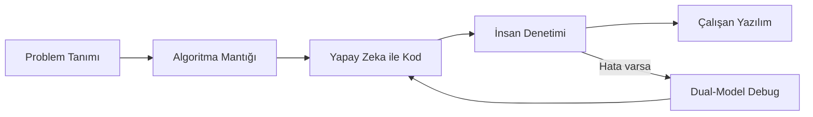

# DİGEM Hibrit Yazılım Dünyası
### Yapay Zeka Güncelliği ve Python Temelleri

> **Dijital Gençlik Merkezi (DİGEM)** — Geleneksel yazılımcılıktan **Yapay Zeka Destekli Geliştiriciliğe (AI-Assisted Development)** geçiş eğitimi.

---

## İçindekiler

- [Bu Eğitim Ne Sunar?](#bu-eğitim-ne-sunar)
- [Sektörün Yeni Normali](#1-sektörün-yeni-normali-hibrit-geliştiricilik)
- [Yapay Zeka Ekosistemi](#2-yapay-zekanın-güncelliği-ve-büyük-dil-modelleri-llm)
- [Öğrenme Metodolojisi](#3-yapay-zeka-ile-eş-zamanlı-python-öğrenme-metodolojisi)
- [Müfredat](#4-eğitim-müfredatının-sac-ayakları-python--ai)
- [Yeni Nesil Yazılımcı İlkeleri](#5-digem-gençliği-için-yeni-nesil-yazılımcı-ilkeleri)
- [Proje Yapısı](#proje-yapısı)
- [Başlangıç](#başlangıç)
- [Önerilen Araçlar](#önerilen-araçlar)

---

## Bu Eğitim Ne Sunar?

| Geleneksel Yaklaşım | DİGEM Hibrit Yaklaşım |
|---------------------|----------------------|
| Syntax ezberleme | Mantık + yapay zeka ile birlikte öğrenme |
| Tek başına kod yazma | AI ajanlarıyla eş zamanlı geliştirme |
| Hata = başarısızlık | Hata = yapay zeka ile canlı debug fırsatı |
| Sadece Python | Python + Prompt / Context Engineering |

Sadece Python kodu yazabilmek artık yeterli değildir. Önemli olan:

- Yapay zekanın **güncel yeteneklerini** bilmek
- Onu **doğru yönlendirmek** (Prompt Engineering)
- Üretilen kodun **mantığını denetleyebilecek** temel Python bilgisine sahip olmak

Bu eğitimde yapay zeka hem **öğrenilecek bir teknoloji** hem de Python öğrenirken kullanılacak **canlı bir öğretmen**dir.

---

## 1. Sektörün Yeni Normali: Hibrit Geliştiricilik

DİGEM öğrencileri, geleneksel yazılımcılardan ayrılarak günümüzün en büyük gücü olan **AI-Assisted Development** dünyasına hazırlanır.



**Sen mimarsın, yapay zeka uygulayıcıdır.** Kod yazmanın büyük kısmı düşünmek; yazmak ise yapay zeka ile hızlandırılır.

---

## 2. Yapay Zekanın Güncelliği ve Büyük Dil Modelleri (LLM)

Yapay zeka dünyası durağan değildir; sürekli güncellenen dinamik bir ekosistemdir.

### Güncel AI Dünyası

Yapay zeka artık sadece basit sohbet robotlarından ibaret değil. Kod yazabilen, terminali okuyabilen, kendi kendine hata çözebilen **Yapay Zeka Geliştirme Ajanları (AI Agents)** çağı başlamıştır.

### Sektörde Kullanılan Güncel Araçlar

| Araç | Kullanım Alanı |
|------|----------------|
| [Cursor](https://cursor.com) | AI destekli IDE, agent tabanlı geliştirme |
| [Windsurf](https://codeium.com/windsurf) | Bağlam odaklı kod asistanı |
| [GitHub Copilot](https://github.com/features/copilot) | Editör içi kod tamamlama |
| [Claude Code](https://www.anthropic.com) | Terminal ve proje odaklı AI ajanı |

### Model Çeşitliliği

Doğru işe doğru modeli seçmek bir geliştirici yetkinliğidir:

| Sağlayıcı | Modeller | Güçlü Olduğu Alanlar |
|-----------|----------|----------------------|
| **OpenAI** | GPT serisi | Genel amaçlı kod, API entegrasyonu |
| **Google** | Gemini | Çok modlu görevler, Google ekosistemi |
| **Anthropic** | Claude | Uzun bağlam, kod analizi, açıklama |

---

## 3. Yapay Zeka ile Eş Zamanlı Python Öğrenme Metodolojisi

Geleneksel eğitimlerde syntax ezberletilirken, bu programda Python temelleri **yapay zeka ile etkileşimli** öğrenilir.

### Algoritma Mantığı (İnsan Rolü)

Kod yazmanın **%80'i düşünmek**, **%20'si yazmaktır.**

- Döngüler (`for`, `while`)
- Karar yapıları (`if` / `else`)
- Fonksiyon mantığı

Bunları kavramak, yapay zekaya **ne yaptırmak istediğini** bilmen için şarttır.

### Context Engineering (Bağlam Mühendisliği)

Yapay zekaya Python kodu yazdırırken projenin amacını, veri tipini ve kısıtlarını doğru anlatabilme yeteneği.

**İyi prompt örneği:**
> "Python'da kullanıcıdan mesafe ve yakıt fiyatı al. Sayı girilmezse program çökmesin; `try/except` ile tekrar sorsun. TL fiyatını USD'ye çevir."

### Dual-Model Hata Ayıklama (Debugging)

Kod yazarken hata alındığında:

1. Hatayı terminale kopyala
2. Yapay zekaya **"Bu hata ne anlama geliyor?"** diye sor
3. Çözümü anlayarak uygula — körü körüne yapıştırma

---

## 4. Eğitim Müfredatının Sac Ayakları (Python + AI)

| Modül | Konu | AI Pratiği |
|-------|------|------------|
| **1** | Temel Syntax ve Değişkenler | Yapay zekadan temiz kod (Clean Code) örnekleri isteme |
| **2** | Veri Tipleri ve `input()` | Dual-model hata ayıklama, tip dönüşümleri |
| **3** | Koşullar ve Döngüler | Edge case testlerini yapay zekaya yaptırma |
| **4** | Fonksiyonlar ve Modüller | Yerleşik kütüphaneleri AI asistanlığıyla keşfetme |
| **5** | Yapay Zeka API Entegrasyonu | OpenAI / Gemini ile mini uygulama (chatbot, özetleyici) |

### Bu Repodaki Ders Dosyaları

```
Yapay-Zeka-Eğitimi/
├── 1-Hello World.py                    # print, aritmetik, değişkenler, veri tipleri
├── 2-Veri Tipleri.py                   # input(), int(), type(), TL → USD dönüşümü
├── 2.1-Veri Tipleri (Yapay Zeka).py    # try/except, while, giriş doğrulama
└── yapay zeka iile yaptığımız projeler/
    └── 1-minecraft/                    # AI destekli web projesi örneği
```

---

## 5. DİGEM Gençliği İçin "Yeni Nesil Yazılımcı" İlkeleri

### Ezberleme, Sorgula
Python'da bir fonksiyonun nasıl yazıldığını unutursan yapay zekaya sorabilirsin. Ama **o fonksiyonun neden orada olması gerektiğini** bilmek senin görevin.

### Yapay Zekayı Eğit
Yapay zeka mükemmel değildir; **halüsinasyon** görebilir (hatalı kod üretebilir). Onu denetleyecek ve doğru yola sokacak kişi, temel Python mantığına hakim olan **sensin**.

### Kontrol Listesi — Her AI Kodunu Şöyle Denetle

- [ ] Kod çalışıyor mu?
- [ ] Veri tipleri doğru mu? (`str` mi `int` mi?)
- [ ] Kullanıcı hatalı giriş yaparsa program çöküyor mu?
- [ ] Kodun ne yaptığını satır satır açıklayabilir misin?

---

## Proje Yapısı

| Dosya | Açıklama |
|-------|----------|
| `1-Hello World.py` | İlk adım: ekrana yazdırma, matematik işlemleri, `str` / `int` / `float` / `bool` |
| `2-Veri Tipleri.py` | Kullanıcıdan veri alma, tip dönüşümü, kur hesabı |
| `2.1-Veri Tipleri (Yapay Zeka).py` | Hata yönetimi: `while`, `try/except`, giriş doğrulama |
| `yapay zeka iile yaptığımız projeler/` | Yapay zeka ile geliştirilen örnek projeler |

---

## Başlangıç

### Gereksinimler

- **Python 3.10+** — [python.org/downloads](https://www.python.org/downloads/)
- **Cursor** veya tercih ettiğin bir AI destekli editör
- İnternet bağlantısı (yapay zeka asistanı için)

### Kurulum

```bash
# Python sürümünü kontrol et
python3 --version

# Repoyu klonla (veya indir)
git clone https://github.com/kullanici/Digem-Yapay-Zeka-Egitimi.git
cd Digem-Yapay-Zeka-Egitimi
```

### İlk Dersi Çalıştır

```bash
python3 "1-Hello World.py"
python3 "2-Veri Tipleri.py"
python3 "2.1-Veri Tipleri (Yapay Zeka).py"
```

---

## Önerilen Araçlar

| Kategori | Araç |
|----------|------|
| IDE | Cursor, VS Code |
| AI Asistan | Cursor Agent, GitHub Copilot, Claude |
| Versiyon Kontrol | Git + GitHub |
| Terminal | Sistem terminali veya Cursor entegre terminal |

---

## Katkı ve Geri Bildirim

Bu repo DİGEM eğitim sürecinde **canlı olarak büyür**. Yeni ders dosyaları, projeler ve AI pratikleri eklendikçe müfredat genişletilir.

---

<p align="center">
  <strong>DİGEM — Dijital Gençlik Merkezi</strong><br>
  Geleceği kodlayan gençler, yapay zekayı yönlendiren mimarlar.
</p>
